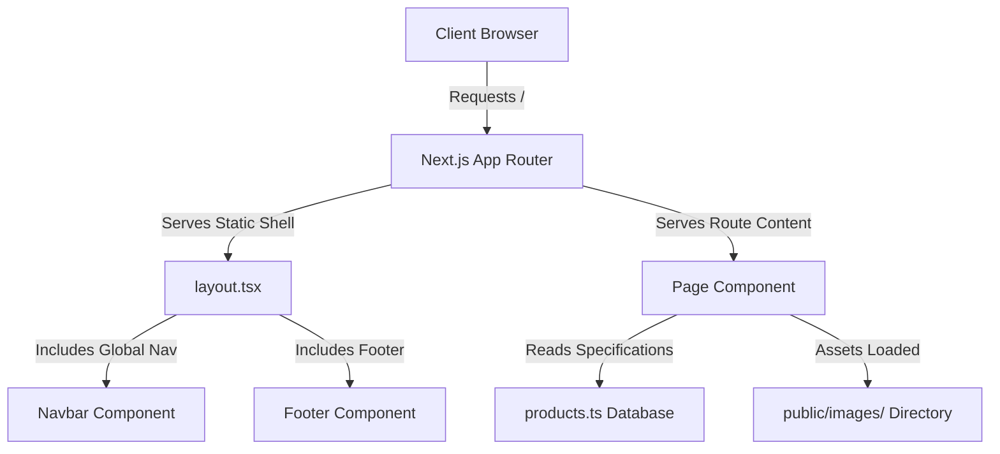

# Business Continuity & System Architecture Guide

This document guarantees that future developers, system architects, and design engineers can understand, extend, and maintain this codebase with zero reliance on the original authors.

---

## 1. System Architecture Overview
The Supreme Systems Solution website is built as a modern, decoupled **Next.js Jamstack web application**. 

### Key Architectural Guidelines:
* **Server Components by Default:** Page structures are optimized to render on the server wherever possible for optimal search crawler indexability (SEO).
* **Interactive Client Islands:** Components that handle dynamic states (e.g. searching, slideshow loops, interactive forms) are declared with `"use client"` at the top of the file to mount safely on the browser.
* **No Database Maintenance Cost:** Product catalog specs are stored in a typed JSON format (`src/data/products.ts`), meaning there are no SQL servers, MongoDB instances, API endpoints, or database tables that can crash, expire, or get hacked.

---

## 2. Design System & Style Tokens
All design specifications are centralized in [globals.css](file:///C:/Users/Kirti%20Rohilla/.gemini/antigravity-ide/scratch/supreme-system-solutions/src/app/globals.css) and Tailwind configurations.

### A. Color Palette
The color tokens are mapped as semantic variables:

* **Primary Corporate Color:** `#0A3D91` (`--color-primary`)
  * *Used for:* Main brand accents, primary buttons, headers, and section highlights.
* **Accent/Copper Winding Color:** `#FF7A00` (`--color-accent`)
  * *Used for:* Highlight badges, call-to-action indicators, hover icons, and critical focus triggers.
* **Dark Base Background:** `#0B0F19` (`--color-dark-bg`)
  * *Used for:* Main dark-theme backgrounds, giving a premium industrial feeling.
* **Dark Card Background:** `#141B2D` (`--color-dark-card`)
  * *Used for:* Overlay panels, catalog cards, and form containers in dark mode.
* **Light Base Background:** `#F8FAFC` (`--color-light-bg`)
  * *Used for:* Default theme background when dark mode is toggled off.

### B. Typography
We use two Google Fonts imported inside Next.js layout structures:
1. **Title / Display Font:** `Outfit` (`var(--font-display)`)
   * *Aesthetics:* Clean, geometric, geometric sans-serif which provides a high-end machinery feel.
   * *Used for:* Major headings, numbers, hero subtitles, and brand logo lettering.
2. **Body Font:** `Inter` (`var(--font-sans)`)
   * *Aesthetics:* Neutral, highly legible sans-serif.
   * *Used for:* Descriptions, table rows, specifications text, and form inputs.

---

## 3. Component & Module Reusability

### UI Elements (`src/components/ui/`)
* **`Button.tsx`**: Standardized button with predefined visual variance (`variant="primary" | "secondary" | "accent" | "outline"`). Handles focus states, loading spinner renders, and hover animations uniformly.
* **`Input.tsx`**: Fully styled wrapper for form inputs with customizable label headers.
* **`TextArea.tsx`**: Multi-line textbox wrapper for custom inquiries.

### Layout Elements (`src/components/`)
* **`Navbar.tsx`**: Sticky desktop and mobile navigation header. Automatically handles menu drawers on small screens, tracks page routes for active line indicators, and holds search form states.
* **`Footer.tsx`**: Global page footer containing static legal text, contacts, and quick links.
* **`ProductSlider.tsx`**: The homepage product showcase slider. Rotates image entries automatically every 3 seconds with a smooth fade animation (`Framer Motion`).
